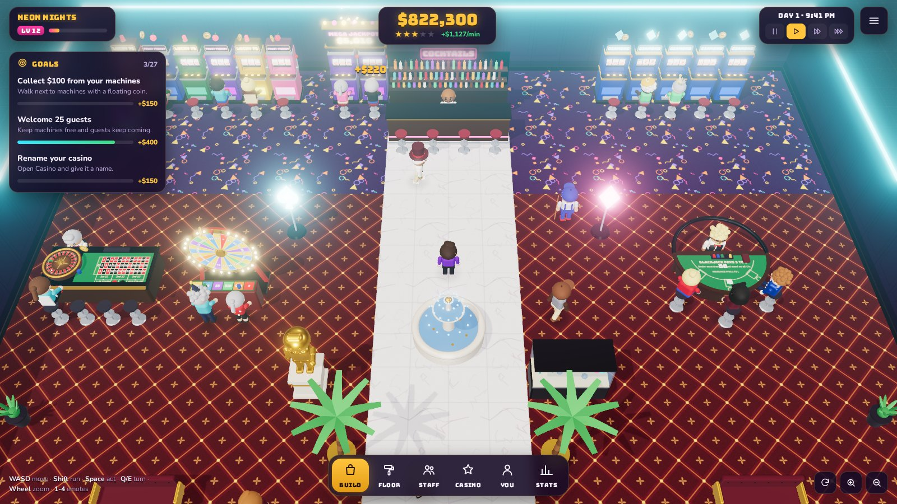
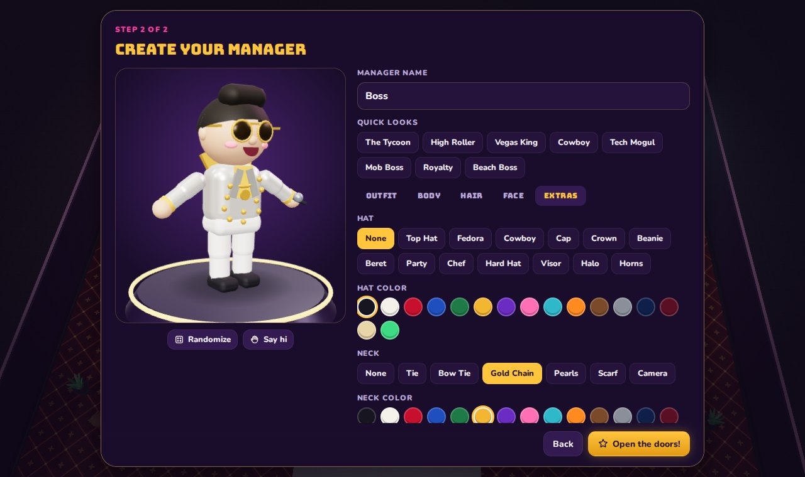

# Jackpot Tycoon

A 3D casino tycoon you play from a top-down (or third-person) camera that follows your manager. Buy slot machines, tables and decorations, drop them wherever you like, keep your guests happy and grow a tiny slot parlor into a tower on the Strip. Then walk out the front door and gamble at the rival casino next door, or at your friends' casinos further down the street.



**Play it: https://scipiotoni.github.io/Casino-simulator/** (multiplayer: everyone who opens the link shares one street).

It runs in any modern browser on desktop or phone. Everything you see and hear is generated in code: every 3D model, texture, carpet pattern, sound effect and the lounge music loop. The project has no art or audio files.

## Features

**Build it your way**
- 36 items across four categories: machines (Lucky 7s, Fruit Frenzy, Diamond Deluxe, the linked **Mega Jackpot**, video poker, keno, claw crane, pachinko), tables (blackjack, baccarat, roulette, Big Six wheel, craps, sic bo, hold'em and Three Card Poker), services (cocktail bar, snack bar, ATM, lounge bench, show stage) and decor (plants, palms, velvet ropes, neon signs, giant dice, gold pillars, a fountain, an aquarium, a money tree, a giant diamond, and a solid-gold statue of *you*).
- Place anything anywhere with a live ghost preview. It turns red if the spot is taken, would block the entrance, or would wall guests off from a seat.
- Click any placed item to **upgrade** it (5 levels: higher bets, bigger cash box, fewer breakdowns), **move** it, **rotate** it, **recolor** it or **sell** it. Slot machines, the bars and the claw crane take your own **sign text**. Changed your mind? Selling within 15 seconds of buying is a full refund.
- Paint the floor tile by tile, or the whole casino in one click, with 12 carpet styles from Royal Crimson and Vegas Retro to marble, gold tiles and a glowing neon grid.
- Rename your casino and restyle its sign (4 lettering styles and 8 colors), the walls and the neon trim. Paint the floor from the Casino panel.
- **Grow wide, deep and tall.** Every lot on the street shares the same width limit (22 tiles), but you can keep building deeper and stack as many floors as you can afford. A glass elevator links the floors, and guests and staff ride it. You choose where the elevator goes (the shaft moves on every floor at once), and any machine can be carried to another floor from its card. Upstairs you really are upstairs: the street drops away below the building, the doorway becomes a window and a banner shows which floor you're on.
- **Decorate the yard:** decorations can also go in the two rows of sidewalk in front of your casino, so the street sees your palms, fountains and neon.
- The building is modelled from the outside too: storeys with lit windows, neon trim, a marquee with chasing bulbs over the entrance and a roof billboard with your casino's name. Step inside and the walls cut away.

**Customize characters**
- A full character creator with 12 hairstyles, 14 hats (including a crown, a halo and devil horns), 12 outfits (sequins, tux, Hawaiian, trench coat…), eyewear, facial hair, neckwear, props, body shapes and skin tones, plus 8 one-click presets and a randomizer.
- You can restyle your staff too. They keep their uniforms.

**A living casino**
- Every guest has a wallet, a bank balance, a mood, thirst, hunger and energy. They pick games they like, bet by their budget, cheer big wins, get grumpy on losing streaks, buy drinks, rest on benches, hit the ATM, watch the show and drop litter. Three cocktails in, they get **tipsy**: they sway, hiccup and bet bigger. They also tell you what's missing ("Slots are fine, but where are the table games?").
- **Real money flow.** Every round settles the moment it ends: when a guest loses, their bet lands in your bank; when a guest wins, you pay them out of it. The house edge wins over time (guests get back roughly 56¢ per dollar on average), but a lucky streak on your floor still stings.
- Real game rules. The slot reels land on the actual result, the roulette ball drops into the winning pocket, blackjack is dealt card by card, dice tumble across the craps table and the big wheel clicks past its pegs.
- **VIP high rollers** sparkle gold: greet them for a tip. **Cheaters** (rare) get a red "?" once they're caught winning too often: bust them to recover the loot. Machines **break down** and smoke until you fix them.
- Hire janitors, technicians, security and **door guards**, who stand at the entrance and turn most cheaters away before they get in. Wages are paid at the end of each day.
- Random events: happy hour, tour buses, VIP parties, power surges and jackpot buzz.
- A star rating built from guest happiness, decor, game variety, cleanliness and working machines. More stars bring more guests and more VIPs.
- 31 goals, casino levels that unlock new items, a daily report and a stats panel.

**The street**
- Casinos line **both sides of the road**, facing each other; cross the street to reach the other side.
- A live **street map** (bottom right, `M` to enlarge) shows every casino and every player. Click the sidewalk or road to teleport there, or a casino to land at its front door. You can never teleport inside a casino.
- **The Golden Viper**, a rival AI casino, sits across the road. It grows (wider, deeper, up to four floors) as players lose money there, and its security walks you out if you win too much.
- You can't gamble in your own casino, so go and play somewhere else, with standard casino rules and paytables:
  - **Blackjack**: 6 decks, dealer stands on all 17s, 3:2 blackjack, insurance 2:1, double on any two, split up to four hands (aces once) and late surrender.
  - **Craps**: pass and don't pass (bar 12), free odds at true odds, the field, hardways and the one-roll props (any 7, any craps, yo, aces, boxcars).
  - **Baccarat** (punto banco with the full third-card rules; banker pays 19:20, tie 8:1, pairs 11:1), **Three Card Poker** (ante, play, pair plus, ante bonus), **Casino Hold'em**, single-zero **roulette**, **sic bo**, the 54-stop **Big Six** wheel, **Jacks or Better** video poker (9/6), **keno**, **slots**, pachinko and the claw crane.
  - Your character sits down at the table, the camera leans in, and every card, spin and roll plays out on the real 3D table as well as on the game screen. There's no maximum bet: pick a chip, type any amount or go all in. You bet from your own bank; what you lose goes to the owner.
- Your casino keeps running while you're out, and catches up when you get back.

**Multiplayer**
- Everyone who opens the game (the public site, or the shared Claude artifact) builds a casino on the same street. You see each other walking around live, with name tags, and you can walk into any published casino and play its games. Losses and wins at another player's tables are settled into their bank through a shared ledger, even if they're offline.
- Owners can **blacklist** a player for 10 minutes: they're walked out and can't come back in until it ends, and there's a 30-minute cooldown before you can blacklist them again.

**Luxury shop**
- Spend your profits on very expensive, completely useless things: a solid-gold crown, a neon halo, a sparkle aura, orbiting lucky dice, a casino pup and a golden pup for your character; searchlights, rainbow neon, nightly fireworks and a gold-plated facade for your casino. Switch them on and off any time. Other players see them too.

**Juice**
- Bloom-lit neon, chasing marquee bulbs, confetti, coin showers, floating money, emoji thought bubbles, camera shake on jackpots, and brighter neon after dark.
- Synthesized sound effects and an optional lounge-jazz music loop.
- **Third-person camera** (`V`): the camera sits behind your manager and turns with them.
- **Photo mode** (`H` or the camera button) hides the HUD so you can admire your casino.
- Autosaves to your browser, with Continue on the title screen.
- **Export and import** your casino from the menu: download it as a file or copy it as text, and load a file or pasted text back (yours or a friend's). Imported files are checked and clamped like any other player's casino.



## Controls

| | Desktop | Touch |
|---|---|---|
| Walk | WASD / arrow keys (Shift to run) | Drag on the left side of the screen |
| Build menu | Build button or `B` | Build button |
| Place / aim | Click the floor (`R` rotates, `Esc` or right-click cancels) | Tap to aim, tap the ghost or ✓ to place; drag to pan |
| Interact | `Space` or `F` (hold to repair) | Action button |
| Camera | `Q` / `E` rotate, mouse wheel zooms, `V` third person (then `A`/`D` turn, `W`/`S` walk) | Pinch to zoom, on-screen camera buttons |
| Floors | Walk into the elevator and press `Space`, or use the floor buttons | Floor buttons |
| Other casinos | Walk out the front door, along the sidewalk or across the road, into their doorway | Same |
| Street map | Click the map to teleport to the sidewalk or road; `M` enlarges it | Tap the map |
| Select | Click a machine, guest or staff member | Tap |
| Emotes | `1`–`4` (wave, dance, cheer, clap) | |
| Pause | `P` or the speed buttons | Speed buttons |
| Photo mode | `H` | Camera button |

## Getting started

Requires Node.js 20 or newer.

```bash
npm install
npm run dev        # http://localhost:5173
```

Other scripts:

```bash
npm run build           # typecheck + production build into dist/
npm test                # unit tests (grid, pathfinding, rotation math, game odds, cards, saves)
npm run preview         # serve the production build
npm run build:artifact  # single-file HTML build in dist-artifact/
```

## Deploying

The build is a static site with relative paths, so `dist/` can be hosted anywhere.

**Multiplayer on a static host** (GitHub Pages, `npm run dev`) goes through a free public MQTT broker over secure websockets (`src/net/relay.ts`, `src/net/mqtt.ts`): positions stream live, and each casino and money ledger is a retained message, so casinos stay on the street while their owners are offline. No accounts or servers to run. The trade-offs: public brokers are open to anyone and promise no uptime, so everything published (casino, name, look) is public, and some school or office networks block the broker's port (8084). Append `?mqtt=wss://your-broker/mqtt` to the page URL to use your own broker.

**Inside Claude** the same code uses the artifact runtime's shared database and live presence instead: publish `dist-artifact/jackpot-tycoon.html` as an artifact with the `db`, `room` and `user` capabilities (see `src/net/net.ts` for the exact rules) and share it. That street is separate from the public one. To let friends put their own casino on the street, give them edit access; people who can only view can still walk the street and play at everyone's tables.

This repo includes `.github/workflows/pages.yml`, which builds and deploys to **GitHub Pages** on every push to `main`. To turn it on, open **Settings → Pages** and set **Source** to **GitHub Actions**. `.github/workflows/ci.yml` typechecks, tests and builds every push and pull request.

## How it works

- **Rendering:** [Three.js](https://threejs.org) with ACES tone mapping, an Unreal bloom pass for the neon, a studio environment map for gold and chrome, and one shadow-casting sun that only re-renders its shadow map when the layout changes. Static parts of each machine are merged into one mesh per material, and characters are merged into about seven vertex-colored parts, so a full casino stays around a few hundred draw calls.
- **Characters** (`src/entities/characterModel.ts`) are built from primitives, merged per bone and animated procedurally: walk, run, sit, pull the lever, deal, sweep, repair, cheer, dance and more, with swappable facial expressions and blinking.
- **Simulation:** a tile grid with A* pathfinding and string-pulled paths, a customer state machine driven by needs and mood, staff task claiming, and machines that resolve every round up front so their animation lands on the real outcome (`src/items/games.ts`).
- **Placement validation** flood-fills from the entrance (or the elevator, upstairs) to guarantee every guest can still reach a seat (`src/items/itemManager.ts`).
- **Floors** are separate grids linked by the elevator: walkers plan a trip to the elevator, ride it, then plan the rest of the way (`src/entities/walker.ts`). Only the floor you're on is drawn.
- **The street** (`src/world/street.ts`) gives every lot its own frame (lots alternate north and south of the road, the south side turned around the road's centre line) and a shared global frame for the street itself. The world is drawn in the frame of the casino you're in, and every other lot is a modelled exterior (`src/world/exterior.ts`). Visiting swaps the interior; your own casino fast-forwards when you return.
- **Multiplayer** (`src/net/net.ts`) publishes your floor plan to a shared document store, streams everyone's position as presence, and settles money through per-player running totals, so nothing is lost if an owner is offline.
- **Audio** (`src/core/audio.ts`) is pure Web Audio: tones and filtered noise shaped by envelopes, plus a small sequencer for the lounge music.

```
src/
  core/      audio, input, math, random, storage, events
  render/    renderer + bloom, materials, procedural textures, particles
  world/     grid, pathfinding, floor painter, walls, exteriors, street, camera, litter
  entities/  character appearance + model, customers, staff, player
  items/     catalog, game rules, 3D models, placed-item runtime, manager
  game/      main game loop, build/placement controller, goals, saves, rival AI
  net/       multiplayer (shared lots, presence, ledger, blacklist; MQTT relay for static hosting)
  ui/        HUD, shop, panels, character creator, title screen
  ui/games/  blackjack, hold'em, roulette, craps, big wheel, slots, quick games
tests/       vitest unit tests
```
